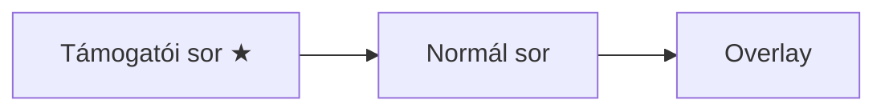

# TankRequests - Streamer.bot Automatizáció

> [!info] Összefoglaló
> Tankkérés rendszer World of Tanks streamereknek. Támogatók tokeneket kapnak, nem-támogatók csatornapontért kérhetnek.

---

## Működési Logika

### Token Rendszer

> [!tip] Tokenek
> A támogatók ingyenes kérési tokeneket kapnak, amik **24 óra után lejárnak**.

| Támogatás típusa | Token |
|------------------|-------|
| Tier 1 / Prime sub | 1 |
| Tier 2 sub | 2 |
| Tier 3 sub | 6 |
| 200 bit | 1 |
| 3€ tip | 1 |

### Két Queue



1. **Támogatói sor** — token terhére, mindig előrébb
2. **Normál sor** — 10.000 csatornapont, támogatói után

### Szorzó

A támogatók kérhetnek szorzóval:
- `IS-7 x3` → 3 tokent von le, de egy csata
- Normál kérésnél nincs szorzó

---

## Parancsok és Funkciók

### !tank parancs
- **Trigger:** `!tank` chat parancs
- **Kimenet:** `@User, elérhető támogatói tankkéréseid: 3 (köv. lejár: 2026-01-09 21:00)`

### Admin Parancsok (Mod/Broadcaster)
- `!addtokens [user] [amount]` - Token hozzáadása
- `!removetokens [user] [amount]` - Token levonása
- `!queuenormal [tank]` - Normál kérés hozzáadása (ingyen)
- `!queuesupporter [tank] [mult]` - Támogatói kérés hozzáadása (ingyen)

### Támogatói Tankkérés
- **Trigger:** Channel Point (konfigurálható pattern, alapértelmezett: "supporter")
- **Kimenet:** `Felvéve: [S] IS-7 x2 – User. Levonva: 2. Maradt: 1.`

### Normál Tankkérés
- **Trigger:** Channel Point (konfigurálható pattern, alapértelmezett: "tank")
- **Kimenet:** `Felvéve: [N] Leopard 1 – User`

### Hotkeys (Konfigurálható)
- **Dequeue:** `Shift+Alt+Ctrl+P` (alapértelmezett)
- **Refund Top:** `Shift+Ctrl+R` (alapértelmezett)

> [!warning] Hibaüzenetek
> - `Nincs elég támogatói tokened (elérhető: 1, kért: x3).`
> - `Adj meg egy tanknevet! Pl.: 'IS-7'`

---

## Telepítési Útmutató

### 1. Mappa létrehozása

```
C:\stream\
├── scheffton.png    ← normál kérés ikonja
└── tankqueue.html   ← automatikusan generálódik
```

### 2. Action-ök importálása

1. Streamer.bot → **Import** gomb
2. Másold be az exportált action kódot
3. Importálandó action-ök:
   - `Balance`
   - `Credit Tokens`
   - `Dequeue Top`
   - `Normal Redeem`
   - `Render Queue`
   - `Setup UI`
   - `Supporter Redeem`

### 3. Setup UI futtatása

Kattints a **Setup UI** action-re → **Test** gomb → töltsd ki:

| Beállítás | Érték |
|-----------|-------|
| Queue overlay TXT | `C:\stream\tankqueue.txt` |
| Queue HTML | `C:\stream\tankqueue.html` |
| Queue sor limit | `5` |
| TTL (óra) | `24` |
| Bits per token | `200` |
| Tip per token | `3` |
| Tier 1 tokenek | `1` |
| Tier 2 tokenek | `2` |
| Tier 3 tokenek | `6` |

---

## Twitch Beállítások

### Streamer.bot összekötés

1. **Settings** → **Broadcasters** → **Twitch**
2. **Connect to Twitch**
3. Jelentkezz be a streamer fiókkal

### Channel Point Rewards létrehozása

> [!important] Fontos
> A reward-okat **Streamer.bot-ban** kell létrehozni, NEM a Twitch Dashboard-on!
> Csak így tudja a bot kezelni a beváltásokat (fulfill/cancel/refund).

1. Streamer.bot → **Platforms** → **Twitch** → **Channel Point Rewards**
2. Kattints a **+** gombra

#### Támogatói Tankkérés
- **Title:** `Támogatói Tankkérés`
- **Cost:** `1`
- **Prompt:** `Írd be a tanknevet (pl. IS-7 x2)`
- ✅ **User Input Required**

#### Normál Tankkérés
- **Title:** `Normál Tankkérés`
- **Cost:** `10000`
- **Prompt:** `Írd be a tanknevet (pl. Leopard 1)`
- ✅ **User Input Required**

### Trigger hozzárendelés

1. **Supporter Redeem** → Triggers → Add
2. **Twitch** → **Channel Point Reward** → **Reward Redemption**
3. Válaszd: `Támogatói Tankkérés`
4. Ismételd **Normal Redeem**-mel

---

## StreamElements Beállítások

### Összekötés

1. Streamer.bot → **Settings** → **Integrations** → **StreamElements**
2. **Connect**
3. JWT Token: StreamElements Dashboard → Account → Show Secrets

> [!note] Megjegyzés
> A Credit Tokens action-höz már hozzá van adva a StreamElements Tip trigger.

---

## OBS Beállítások

### Browser Source

| Beállítás | Érték |
|-----------|-------|
| Név | `Tank Queue` |
| URL | `file:///C:/stream/tankqueue.html` |
| Szélesség | `400` |
| Magasság | `350` |
| ✅ | Refresh browser when scene becomes active |

> [!tip] Auto-frissítés
> Az overlay automatikusan frissül 2 másodpercenként.

---

## Stream Deck Beállítások

### Dequeue gomb

1. Húzz egy **Hotkey** gombot
2. Title: `Következő`
3. Hotkey: `Ctrl+Shift+D`

---

## Overlay Megjelenés

| Típus | Ikon | Szín |
|-------|------|------|
| Támogatói (token) | ★ | `#46c89e` |
| StreamElements Tip | összeg | `#46c89e` |
| Normál (10000 pont) | scheffton.png | — |

- Fekete háttér
- Teal elválasztó vonal
- Max 5 sor + `+n a sorban` footer

---

## Hibaelhárítás

> [!bug] Gyakori problémák

| Probléma | Megoldás |
|----------|----------|
| Nem jön létre HTML | Ellenőrizd: `C:\stream\` mappa létezik? |
| Nincs token jóváírás | Ellenőrizd a triggereket |
| Overlay nem frissül | OBS: frissítsd a Browser Source-ot |
| `!tank` nem működik | Ellenőrizd a Chat Command triggert |

---

#streamerbot #wot #automation
