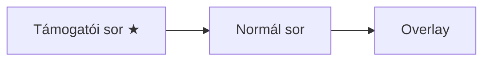

# TankRequests - Streamer.bot Automatizáció

> [!info] Összefoglaló
> Tankkérés rendszer World of Tanks streamereknek. Támogatók tokeneket kapnak, nem-támogatók csatornapontért kérhetnek.

---

## Újdonságok (Phase 9)
- **!tankinfo:** A `!tank` parancs most már mutatja a sorban elfoglalt pozíciót és a becsült várakozási időt is.
- **Speciális Kérések:** `xA` (Arty), `xF` (Blacklist), `xT` (Troll) kódok támogatása egyedi árazással.
- **Overlay:** A támogatói kérések zöld színnel kiemelve.

---

## Működési Logika

### Token Rendszer

> [!tip] Tokenek
> A támogatók ingyenes kérési tokeneket kapnak, amik **24 óra után lejárnak**.

| Támogatás típusa | Token |
|------------------|-------|
| Tier 1 / Prime sub | 1 |
| Tier 2 sub | 2 |
| Tier 3 sub | 6 |
| 200 bit | 1 |
| 3€ tip | 1 |

### Két Queue



1. **Támogatói sor** — token terhére, mindig előrébb
2. **Normál sor** — 10.000 csatornapont, támogatói után

### Árazás és Szorzók

> [!important] Speciális Tankok
> Bizonyos tanktípusok több tokenbe kerülnek. Használd a kódokat a tanknév után!

| Típus | Kód | Ár (Token) | Példa |
|-------|-----|------------|-------|
| **Normál** | - | 1 | `IS-7` |
| **Szorzó** | `x2`, `x3`... | 2, 3... | `Tiger x2` |
| **Arty** | `xA` | 5 | `M44 xA` |
| **Feketelista** | `xF` | 3 | `Leichttraktor xF` |
| **Troll** | `xT` | 10 | `FV4005 xT` |

---

## Parancsok és Funkciók

### !tankinfo parancs
- **Trigger:** `!tankinfo` (vagy `!tank`) chat parancs
- **Kimenet (sorban állás nélkül):** `@User, Egyenleg: 3 (lejár: 21:00).`
- **Kimenet (sorban állva):** `@User, Egyenleg: 3 (lejár: 21:00). Pozíció: 3. (kb. 8 perc múlva)`

> [!note] ETA Számítás
> Kb. 8 perc / csata. Az éppen futó csatát és a saját magadat nem számolja a várakozási időbe.

### Admin Parancsok (Mod/Broadcaster)
- `!addtokens [user] [amount]` - Token hozzáadása
- `!removetokens [user] [amount]` - Token levonása
- `!queuenormal [tank]` - Normál kérés hozzáadása (ingyen)
- `!queuesupporter [tank] [mult/code]` - Támogatói kérés hozzáadása (ingyen). Pl: `!queuesupporter M44 xA`

### Támogatói Tankkérés
- **Trigger:** Channel Point (konfigurálható pattern, alapértelmezett: "supporter")
- **Kimenet:** `Felvéve: [S] IS-7 x2 – User. Levonva: 2. Maradt: 1.`
- **Kimenet (Arty):** `Arty kérés kiváltva: M44 (5 token). Maradt: 1.`

### Normál Tankkérés
- **Trigger:** Channel Point (konfigurálható pattern, alapértelmezett: "tank")
- **Kimenet:** `Felvéve: [N] Leopard 1 – User`

### Hotkeys (Konfigurálható)
- **Dequeue:** `Shift+Alt+Ctrl+P` (alapértelmezett)
- **Refund Top:** `Shift+Ctrl+R` (alapértelmezett)

---

## Telepítési Útmutató

### 1. Mappa létrehozása

```
C:\stream\
├── scheffton.png    ← normál kérés ikonja
└── tankqueue.html   ← automatikusan generálódik
```

### 2. Action-ök importálása

1. Streamer.bot → **Import** gomb
2. Másold be az exportált action kódot
3. Importálandó action-ök: `Balance`, `Credit Tokens`, `Dequeue Top`, `Normal Redeem`, `Render Queue`, `Setup UI`, `Supporter Redeem`

### 3. Setup UI futtatása

Kattints a **Setup UI** action-re → **Test** gomb → töltsd ki:

| Beállítás | Érték |
|-----------|-------|
| Queue overlay TXT | `C:\stream\tankqueue.txt` |
| Queue HTML | `C:\stream\tankqueue.html` |
| Queue sor limit | `5` |
| TTL (óra) | `24` |
| Arty Ár | `5` |
| Blacklist Ár | `3` |
| Troll Ár | `10` |
| Csata Hossz (perc) | `8` |

---

## OBS Beállítások

### Browser Source

| Beállítás | Érték |
|-----------|-------|
| Név | `Tank Queue` |
| URL | `file:///C:/stream/tankqueue.html` |
| Szélesség | `400` |
| Magasság | `350` |
| ✅ | Refresh browser when scene becomes active |

> [!tip] Auto-frissítés
> Az overlay automatikusan frissül 2 másodpercenként.

---

#streamerbot #wot #automation
